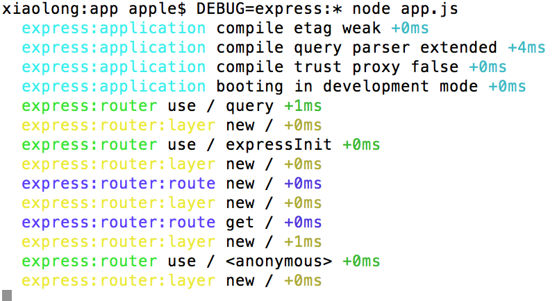

# Express

http://expressjs.com/

## 安装

- 如何安装
- 如何使用generator

generator是express命令工具集，首先确保已经安装node和npm,先在全局安装这个工具集:
	
	$npm install -g express-generator
	
如果安装失败，尝试加sudo权限:

	$sudo npm install -g express-generator
	
现在新建一个文件夹装我们的express应用:

	$mkdir expressApp
	
然后执行:

	$express expressApp
	
项目创建完毕，文件结构如下:

打开package.json，可以看到依赖的模块，执行命令来下载依赖的模块:

	$npm install
	
如果下载依赖失败，尝试加sudo权限:

	$sudo npm install
	
下载依赖模块成功后，可以看到在node_modules文件夹下多出了这些模块:

回到app.js层级，执行:

	$npm start
	
开始运行express打开端口，用浏览器打开http://localhost:3000/，在此估计会出现缺少模块的情况，如果有模块缺少，cd到node_modules文件夹下去安装缺失的模块:

	$sudo npm install xxx(模块名称)

大概会缺失5个模块左右，模块全部安装完成，浏览器则会输出:

完毕,说明express安装成功.

## 阅读文档
### getting start

新建文件夹:

	$mkdir /getting start/app
	

cd到app下,运行:

	$sudo npm install express
	
将express安装在此目录下,新建app.js文件:

	var express = require('express');
	var app = express();

	app.get('/',function(req,res){
    	res.send('hello,world');
	});

	app.listen(5000);
	
终端运行:

	$node app.js
	
开启端口，浏览器访问localhost:5000，输出:

### guide

Error handling

监听server服务错误，如get请求的时候输出一个没定义的变量a，这时express捕捉到错误，并返回'Something broke!':

	app.get('/',function(req,res){
    	res.send(a);
	});

	app.use(function(err, req, res, next){
  		console.error(err.stack);
  		res.status(500).send('Something broke!');
	});

终端输出:

浏览器返回:

Debugging Express

Expressy已经内置了debug模块，如果要用debug运行app.js:

	$DEBUG=express:* node app.js
	

### 知道如何查api文档

中文文档地址 

http://www.expressjs.com.cn

## 核心概念

Express 是一个简洁、灵活的 node.js Web 应用开发框架, 它提供一系列强大的特性，帮助创建各种 Web 和移动设备应用。

### 理解public目录

- 常规做法
- 如何在静态页面处理请求参数

在静态页面处理请求参数，是通过连接地址把参数传递过去，通过前端jacascript取出做处理。

理解express.static和http-server的差别

http-server只做静态托管文件，输出请求文件，无法拦截到请求参数;
express.static不仅可以托管静态文件，并且提供接口可以拦截到前端页面的请求参数，并且可以控制返回数据;

### 理解模板jade
- http://jade-lang.com/

还有handlebars

以及如何用生成器指定模板

### 理解路由

- 常规做法
- 使用路由重定向

常规定义路由:

	var myHttpGet = require('./routes/getserver');
	app.use('/getserver', myHttpGet);
	
定义一个myHttpGet模块，再定义一个'/getserver'路由，当请求路径为'/getserver'时，调用myHttpGet模块.

### 请求request

HttpServletRequest对象是有关于客户端所发出的请求的对象，只要是有关于客户端请求的信息，都可以藉由它来取得，例如请求标头、请求方法、请求参数、客户端IP，客户端浏览器等等信息。

### 响应response

HttpServletResponse对象是有关于对客户端请求之响应，您可以利用它来设定一些要响应的讯息，例如标题信息、响应状态码等.

### session

## 任务

### 了解http协议

HTTP协议（HyperText Transfer Protocol，超文本传输协议）是用于从WWW服务器传输超文本到本地浏览器的传送协议。它可以使浏览器更加高效，使网络传输减少。它不仅保证计算机正确快速地传输超文本文档，还确定传输文档中的哪一部分，以及哪部分内容首先显示(如文本先于图形)等。
HTTP是一个应用层协议，由请求和响应构成，是一个标准的客户端服务器模型。HTTP是一个无状态的协议。

### 如何处理get请求

我们可以在一个html文件里向端口发送get请求，首先要在访问http://localhost:3000下，端口能向浏览器输出此html，默认情况下，express是会输出pubblic文件夹下的index.html文件，在没有特别指明的情况下，所以注释掉:

	//app.use('/', routes);
	
这样在get请求的url为'/'时，express会找到pubblic文件夹;我们可以自定义路由:

	//自定义路由
	var myHttpGet = require('./routes/getserver');
	app.use('/getserver', myHttpGet);
	
当get请求的url为/getserver时，express会执行myHttpGet模块，在routes文件夹下实现myHttpGet模块:

	var express = require('express');
	var router = express.Router();

	/* GET http.*/
	router.get('/', function(req, res) {
		var sUrl = req.url;
		var arr = sUrl.split('?');
		var arrReq = arr[1].split('&');
		var resJson = {};

		for(var i=0; i<arrReq.length; i++){
			//['xx=xx','xx=xx']
			var newarr = arrReq[i].split('=');
			var attr = newarr[0];
			var value = newarr[1];
			resJson[attr] = value;
		};
		res.send(resJson);
	});

	module.exports = router;
	
当我们在html里用ajax向此路由发送get请求时，我们可以取到参数，做一些处理后，用:

	res.send(resJson);
	
返回给ajax对象:

		oGetBtn.onclick = function(){	

			 $.ajax({
	             type: "GET",
	             url: "http://localhost:3000/getserver",
	             data: {
	             	'method':'GET',
	             	'name':'rainBow',
	             	'sex':'man'
	             },
	             dataType: "json",
	             success: function(data){
                    var str = JSON.stringify(data);
					oResBox.innerHTML = str;
                  }
	         });
		};
		
点击GET按钮发送GET请求，并把发出去的参数整理成json格式并返回:

	

### 如何处理post请求

在myHttpGet模块里添加接收此路由下得post请求代码,对于post请求，用req.body接收post参数:

	/* POST http.*/
	router.post('/', function(req, res) {
		res.send(req.body);
	});

点击按钮post发送post请求:

			$.ajax({
	             type: "POST",
	             url: "http://localhost:3000/getserver",
	             data: {
	             	'method':'POST',
	             	'name':'rainBow',
	             	'sex':'man'
	             },
	             dataType: "json",
	             success: function(data){
	                var str = JSON.stringify(data);
					oResBox.innerHTML = str;
	              }
	         });
	         

### 如何实现文件上传

### request里如何取值

- body
- params
- query

各自举例

body处理post请求参数，把参数整理成json各式:

	router.post('/', function(req, res) {
		res.send(req.body);
	});
	
query处理get请求参数，整理成json各式:

	router.get('/www:soso', function(req, res) {
		res.send(req.query);
	});

### response返回

- text
- xml
- json

## 实践积累

试着说明package.json的众多方面

- `npm install --save`  vs `npm install --save-dev`
- `npm start` vs `npm test` (scripts自定义)
- 如何写一个npm，以及发布

## 总结

