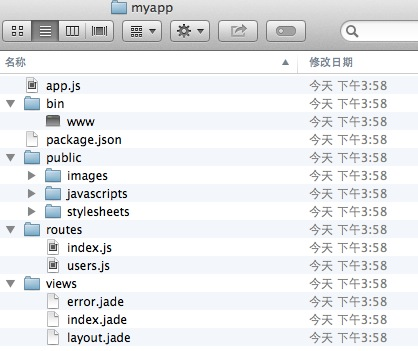

# Express

http://expressjs.com/

## 安装

### 如何安装

  切换到相应目录下，需依赖npm,如未安装请先安装npm
  
  创建一个 package.json 文件，或者用命令创建：
	
	$ npm init
	
生成代码：
	
```
{
  "name": "express",
  "version": "0.0.0",
  "description": "express",
  "main": "index.js",
  "scripts": {
    "test": "express"
  },
  "repository": {
    "type": "git",
    "url": "https://github.com/nodeonly/nodejs-tutorial"
  },
  "keywords": [
    "express"
  ],
  "author": "kezhi",
  "license": "3000"
}
```

  安装express并将其保存在依赖列表：
	
	$ npm install express --save
	
  将会生成 `node_modules` 目录
	
  如不保存到依赖列表：
		
	$ npm install express


### 如何使用generator

  使用应用程序生成器工具,表达,快速创建一个应用程序框架。
  
	$ npm install express-generator -g  	
	
  创建一个名为myapp的应用
  
  ```
   express myapp	    
  	
 
   create : myapp
   create : myapp/package.json
   create : myapp/app.js
   create : myapp/public
   create : myapp/public/javascripts
   create : myapp/public/images
   create : myapp/public/stylesheets
   create : myapp/public/stylesheets/style.css
   create : myapp/routes
   create : myapp/routes/index.js
   create : myapp/routes/users.js
   create : myapp/views
   create : myapp/views/index.jade
   create : myapp/views/layout.jade
   create : myapp/views/error.jade
   create : myapp/bin
   create : myapp/bin/www

   install dependencies:
     $ cd myapp && npm install

   run the app:
     $ DEBUG=myapp ./bin/www
     
  ```
  
  
  将会生成如下目录：




## 阅读文档
### getting start
### guide
### 知道如何查api文档

## 核心概念
### 请求request

### 响应response

### session

## 任务

### 了解http协议

### 如何实现get请求
```
var express = require('express');
var app = express();

app.get('/', function(req, res){  
    console.log(req.query.name,req.query.password);    
    res.send('name:'+req.query.name+'</br>password:'+req.query.password);    
});    
app.listen(3000);
console.log('Listening on port 3000');  
```

在浏览器中输入：

`http://localhost:3000/?name=kezhi&password=12345`


### 如何实现post请求

### 如何实现文件上传

### request里如何取值

- body
- params
- query

### response返回

- text
- xml
- json

## 实践积累


## 总结


